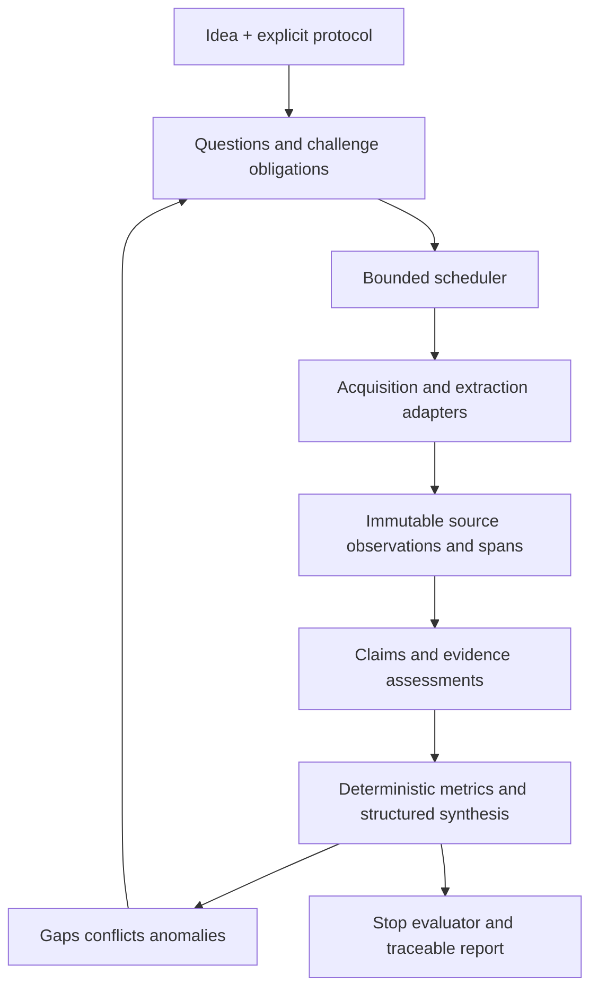

# IAAI Architecture v0.1 — предложение

Статус: **DRAFT / NOT ACCEPTED**, 2026-09-07. Только дизайн, schemas и pseudocode.
Связанный документ: [критический аудит](architecture-review-v0.1.md).
Все лимиты и thresholds ниже — стартовые параметры для benchmark, не гарантии качества.

## 1. Scope и исследовательский протокол

`ResearchProtocol` фиксирует исходный текст, нейтральный IdeaSpec, предположения,
product configuration, geography, population/segment, time horizon, languages,
целевые вопросы, единицы, playbook revisions, acquisition policy и stop policy.
Эмоциональные прилагательные сохраняются в original input, но не подаются в retrieval
или assessment. Смысловые ограничения пользователя сохраняются. Изменение сегмента,
цены или конструкции создаёт Scenario, а не незаметное изменение исходной идеи.

`KeyOutput` — проверяемый выход: «willingness-to-pay в диапазоне P для сегмента S»,
«достижимость X часов при нагрузке L». Нельзя использовать только «хорошая идея».
Каждый выход задаёт meaningful delta: смена assessment, пересечение явного порога,
изменение интервала более установленного допуска. Допуски имеют unit и источник.
Без определённых выходов materiality помечается provisional.



Стрелки показывают data flow. Compile-time dependency direction другая:
application → domain + ports; adapters → ports; composition root выбирает adapters.
Core никогда не импортирует adapters. Упрощённое «Core→Ports→Adapters» неверно как
граф импортов: port не должен знать конкретную реализацию.

## 2. Domain model: типы вместо одного списка epistemic states

| Объект | Содержание и инвариант |
| --- | --- |
| Source / SourceObservation | Identity издателя/ресурса и неизменяемая версия получения: URL chain, IDs, timestamps, hashes |
| ExtractionArtifact / Chunk | Текст, страницы, таблицы, extraction version; offsets привязаны к конкретному text hash |
| Assertion / Claim | Атомарное утверждение: subject, predicate, object/value, units, population, place, time, conditions, quantifier |
| NormalizedAssertion | Явное преобразование исходного claim; не повышение истинности |
| Hypothesis | Роль assertion как проверяемого объяснения; предсказания, alternatives и falsifiers |
| EvidenceLink | Span→assertion, relation, applicability, origin group, assessor/version, validation |
| DerivedMetric | Versioned formula + inputs + units + interval + assumptions; не LLM output |
| Inference | Типизированное правило, premises, scope, assumptions, counterevidence и результат |
| Assessment | Версия оценки assertion в research revision, evidence summary и uncertainty |
| Conflict | Конкретные несовместимые assertions в сопоставимом scope; type и resolution history |
| Gap / Unknown | Объект незнания с причиной, attempted tests, impact и reopening condition |
| ResearchQuestion / Task | Семантическая цель отдельно от исполняемого шага и его retries |
| Entity / EntityLink | Canonical identity и версионируемые same-as/possible-match связи |
| ResearchRevision | Согласованная граница знания и выводов, protocol/config/input manifest |

`RAW_EVIDENCE` лучше разложить на сохранённое наблюдение источника и EvidenceLink.
Фрагмент становится evidence только относительно конкретного assertion.
`UNKNOWN` не состояние task. `CONFLICT` не тип исходного доказательства.
`Counterclaim` — другое assertion со связью contradicts/alternative-to, не отдельная
иерархия классов. `Document` — identity ресурса, а не изменяемый мешок текста.

Assessment: `UNASSESSED`, `SUPPORTED_WITHIN_SCOPE`, `CONTRADICTED_WITHIN_SCOPE`,
`MIXED`, `INSUFFICIENT_EVIDENCE`, `NOT_TESTABLE_AS_STATED`. Отдельные оси:
coverage, materiality, freshness, applicability и review state.
`RETRACTED`/`SUPERSEDED` — lifecycle assertions, не степень поддержки.
Сильное conflicting evidence не усредняется до средней уверенности.

## 3. Research Graph

Типизированный property graph поверх relational tables. Узлы: вопросы, assertions,
tests, artifacts, inferences, outputs и gaps. Edges: `depends_on`, `addresses`,
`supports`, `contradicts`, `alternative_to`, `derived_from`, `cites`, `supersedes`.
Каждое ребро имеет creator operation, revision, scope и reason.

Evidence/provenance dependency subgraph должен быть DAG: output может зависеть
только от уже committed immutable inputs; запрет self-support и circular inference.
Research-question graph может содержать циклы ссылок: они не инициируют tasks сами.
Для traversal использовать visited set/SCC и distinct downstream outputs; количество
путей не считается числом независимых аргументов.

Admission нового вопроса:

1. Нормализовать scope, predicate, entities и desired observation.
2. Exact fingerprint dedup; semantic match только предлагает эквивалентность.
3. Найти существующий вопрос, добавить provenance/motivation вместо clone.
4. Требовать source gap, material scenario или обязательство playbook/challenge.
5. Записать `candidate`; admission в frontier только при priority и capacity.

Начальные ограничения: active frontier ≤40, не более 3 proposed children за одну
операцию генерации, semantic duplicates не дают novelty. Остальное — deferred ledger
с причиной; переполнение общего graph budget даёт ресурсный исход, а не convergence.
Нет правила «достигнута глубина 4 — вопрос решён». Неактивные material candidates
участвуют в stop evaluation.

## 4. FOR / AGAINST без двух предвзятых корпусов

Один corpus, один assertion, один evidence ledger. Для каждого material assertion
создаются obligations: neutral inquiry, strongest counterexample search, alternative
explanation, discriminating test. Это views/tasks общего вопроса, не два изолированных
дерева. Search intents сохраняются, но assessment не видит ожидаемый FOR/AGAINST label.

Сначала извлечь, что источник действительно утверждает; затем сопоставить scope,
population, measurement и relation. `supports`, `contradicts`, `context_only`,
`not_applicable`, `uncertain`. NLI neutral соответствует неопределённости отношения,
не отсутствию факта. Разные даты, workloads, виды продукта и сегменты часто дают
scope mismatch, а не contradiction. Causal claim требует causal design/assumptions.

Challenge selection: для key output вычислить lexicographic rank (materiality,
текущая определённость, число ещё не проверенных assumptions). Выбрать сильнейший
с неисполненным challenge obligation. После выполненного challenge в той же
evidence revision повторение запрещено; новое independent evidence или изменение
premises открывает obligation снова. Это предотвращает бесконечную атаку одного тезиса.

Bias controls: нейтрализация framing; зеркальные hypothesis permutations; общие
источники; один список criteria; поиск отрицательных случаев; отдельная выборка
низкорелевантных кандидатов; blind human annotation. Общая LLM для двух ролей не
создаёт независимых исследователей. Дисбаланс labels — диагностический сигнал,
не требование искусственно добавить AGAINST. Самая важная метрика — пропущенные
material counterexamples, а не равенство размеров сторон.

## 5. Source authority, lineage и отсутствие evidence

Authority profile хранит роль/компетенцию для claim type, близость к наблюдению,
метод измерения, sample/population, incentives, временную применимость и доступный
audit trail. Manufacturer подтверждает заявленные specs, но не независимую надёжность;
user report — существование сообщения, но не prevalence неисправности.

Lineage graph на уровне assertions: copied-from, cites, same-study, same-dataset,
same-measurement, sponsored-by. Hash/near-duplicate и явная citation дают candidate
группу, shared wording без ссылки даёт `POSSIBLY_DEPENDENT`. Разные домены не
гарантируют независимость; одна статья может содержать несколько независимых измерений.
Группы пересекаются (dataset и funding не одно и то же), поэтому хранить основания
зависимости, а не единственный group integer на документ.

Для corroboration используется консервативный distinct measurement/origin count:
50 копий одного press release дают один origin. При неизвестной зависимости отчёт
показывает диапазон independent groups и sensitivity при объединении подозрительных
групп. Нельзя рассчитывать posterior, перемножая зависимые model scores.

SearchObservation фиксирует query, intent, provider/config, rank, URLs, snippets,
time, language/geography, completion/errors. Coverage ledger: question × source
family × geography/language × time × test intent. Состояния `NOT_ATTEMPTED`,
`SEARCHED`, `BLOCKED`, `INADEQUATE`, `NOT_APPLICABLE` с reason.

Absence states:

- `NOT_FOUND_IN_SEARCHED_SOURCES`: ledger ограничивает значение результата.
- `INSUFFICIENT_COVERAGE`: нельзя делать отрицательный вывод.
- `SEARCH_BLOCKED`: недоступность не нулевой результат.
- `ABSENCE_ESTABLISHED_WITHIN_ENUMERABLE_DATASET`: определён закрытый universe,
  получены все страницы/записи, snapshot/version, predicate и validation полноты.
- `NO_DETECTED_SIGNAL_AT_STATED_SENSITIVITY`: только если известны detector sensitivity,
  sampling assumptions и границы; это не доказанное абсолютное отсутствие.

Регуляторная строка `NO_CRITICAL_BARRIER_FOUND` обязана перечислять юрисдикции,
проверенные требования и пропуски; это не разрешение на продажу.

## 6. Вычислимые materiality и scheduler

Материальность определять относительно KeyOutputs, а не «важности темы» по мнению LLM.
Для вопроса q задать plausible answer scenarios из измеренных интервалов,
противоречащих observations или явно помеченных допущений. Отсутствие границ —
`UNBOUNDED_UNCERTAINTY`, не нулевая важность.

Для каждого reachable key output k прогнать локальную dependency evaluation под
каждым scenario, остальные inputs фиксировать. `d_k(q)=1`, если меняется assessment,
пересекается decision boundary или metric меняется больше meaningful delta;
иначе 0. `M(q)=max d_k(q)`. Для численного ранжирования допускается clipped
delta/tolerance, максимум 1. Проверять также пары чувствительных assumptions:
one-at-a-time анализ пропустит совместные пороги. Недоступное правило inference
даёт `M_unknown`; q резервируется для exploration, а не получает 0.

При необходимости веса key outputs задаются protocol, default равные; это не score
идеи. Downstream factor `D=log(1+n_distinct_outputs)/log(1+n_all_outputs)`.
U=1 для неизвестного/широкого интервала, .5 для bounded mixed, 0 для стабильного
низкорискового вопроса; C=1 для active material conflict иначе 0; G — доля обязательных
coverage cells, для которых ещё нет пригодной попытки. Все значения объяснимы.

Estimated yield Y: smoothed доля прошлых successful acquisitions данного provider ×
task type, которые дали validated independent material observation. Пока данных мало,
Y=.5 с флагом prior. Это proxy, не теоретический information gain и не LLM вероятность.
Стоимость c — сумма прогнозируемого CPU/token/byte расхода, нормированного на initial
budgets с публичными весами; lower bound .01. Начальная формула:

`priority = (4*M + 2*U + 2*C + D + G) * (0.25 + 0.75*Y) / sqrt(max(c, .01))`.

Cheap tasks не могут монополизировать scheduler: в каждых 10 dispatch slots 6 —
priority exploitation, 2 — FIFO oldest eligible, 2 — seeded sampling из unknown-M,
новых source families и deferred candidates. При меньшей очереди неиспользованные
слоты перераспределяются. Within finite eligible frontier FIFO предотвращает
starvation; при непрерывном admission полной гарантии нет — поэтому frontier bounded.
Long task выполняется cancellable chunks с work reservation, не блокирует очередь.

Runnable только если dependencies committed, lease свободна, retry_at наступил,
есть resource reservation. Tie-break по immutable question ID. Сохранять все
компоненты priority и reason. На benchmark сравнить с FIFO и равномерным playbook:
сложная формула оправдана только улучшением critical-gap recall на единицу ресурсов.

## 7. Convergence algorithm

Глобальную completeness для открытого мира не заявлять. `CONVERGED_WITHIN_SCOPE`
означает устойчивость по опубликованному protocol, не «истина установлена».
Вычислять на consistent ResearchRevision после завершения work round. Round:
обслужены текущие runnable critical obligations и exploration slots; adaptive
frontier фиксируется на старте round, новые вопросы идут в следующий. Счётчик
итераций не является причиной завершения.

Первоначальное окно W=3 qualifying rounds; минимум 5 новых независимых source
observations в каждом, либо доказанное исчерпание конечного доступного corpus.
Failed fetch и дубликаты не входят в denominator. В online sparse corpus без такого
минимума и без доказуемой исчерпанности результат `STALLED_INSUFFICIENT_COVERAGE`.

Novelty: `N = number of accepted distinct material assertion/metric/conflict changes /
max(1, number of independent observations evaluated)`; для gating также абсолютное
число новых critical questions должно быть 0. New entity/topic rate и semantic
duplication — диагностические сигналы, не достаточные причины остановки.

Report signature состоит из key output IDs/statuses, нормализованных metric intervals,
material conflicts/unknowns, существенных assumptions и scenario boundaries.
Не сравнивать prose/embeddings отчёта. S=stable, если все discrete fields равны,
изменение чисел ниже tolerance и нет нового material premise. Полная замена evidence
при том же label всё равно сбрасывает stability для затронутого key output.

```text
at committed revision r:
  if resource budget exhausted: INCOMPLETE_RESOURCE_LIMIT
  elif fatal persistence/integrity error: FAILED_SYSTEM
  else:
    compute coverage, deferred material gaps, challenges, report_signature
    if new material evidence/gap/premise: reset qualifying window
    append round only if independently informative or enumerably exhausted
    if W rounds AND N <= .05 in every round AND signature stable
       AND no runnable or deferred unhandled critical obligation
       AND every material conflict has resolution or explicit bounded unresolved record
       AND required coverage cells satisfied or bounded unknown certified
       AND fresh exploratory/challenge sweep complete:
         CONVERGED_WITHIN_SCOPE
    elif no feasible tasks and coverage gates fail:
         STALLED_INSUFFICIENT_COVERAGE
    else: continue
```

Explorer sweep включает missing playbook families, alternative segments только как
scenarios, unexplained opportunity checklist, independent source family и adversarial
query. Он снижает риск неизвестных веток, но не измеряет вероятность их отсутствия.
Certificate перечисляет protocol, W, N, signature deltas, coverage, exclusions,
UNKNOWNs, unresolved conflicts и frontier. Все thresholds калибруются held-out тестами.

Допустимый UNKNOWN: вопрос scoped; relevant acquisition/test pathways реально
попробованы или документально недоступны; нет доступной material попытки, которую
просто отложили; bounds/impact и reopen trigger записаны. Если UNKNOWN способен
перевернуть вывод, вывод остаётся insufficient/conditional. Unresolved conflict
допустим после проверки scope, lineage, extraction и доступных discriminating tests;
его нельзя скрыть усреднением. `CONVERGED_WITHIN_SCOPE` может иметь итог insufficient.
User stop=`PAUSED_USER`; не смешивать с convergence. Cap гарантирует конечную работу
при endlessly expanding corpus. При равновременном достижении cap приоритет cap:
он не маскируется сходимостью.

## 8. Resource budgeting и hardware

€0 означает отсутствие обязательных платных услуг; electricity, время пользователя,
доступ в интернет и free-provider availability не являются бесплатными гарантиями.
Бюджеты сохраняются в ResearchState и между resume; sleep не сбрасывает counters.

Для первого эксперимента: run disk 2 GiB, decompressed text 200 MiB, CPU 2 часа,
generated tokens 50k, graph 5k nodes, raw cache 512 MiB; общий storage pool 20 GiB,
host free reserve 30 GiB. Это cap, не размер необходимого исследования.
Active elapsed deadline 4 часа защищает от зависаний; отдельно wall deadline с
учётом sleep и resume policy. Тысячи циклов допустимы в другом budget manifest.
Нет max_queries как критерия завершения; request retries и per-operation deadlines
всё равно ограничены, чтобы один task не завис навечно.

Admission резервирует верхнюю оценку CPU/tokens/bytes и место для commit/checkpoint.
Streaming download/decompression проверяет actual bytes, workers контролируются по
RSS/CPU/time, generation имеет token bound. Превышение: cancel task, checkpoint,
сохранить partial status без публикации неполного результата как DONE. Disk reserve
включает WAL, temp, indexes, backups и исключает новые downloads. При hard-full диске
commit может физически не пройти: восстановить последний durable state, отдельно
зафиксировать аварию после освобождения места. Не обещать невозможный финальный commit.

Ноутбук: один coordinator asyncio для I/O, максимум 2–4 network operations с
per-host throttling, один extraction process, один ML subprocess; SQLite writer
только coordinator. Небольшие thread pools для блокирующего I/O; CPU parsing/OCR
в процессе с timeout. Windows spawn workers, без зависимости от fork.

Стартовый ceiling процесса/worker pool: 16 GiB RSS; оставить ≥8 GiB ОС и запас.
Одна модель активна; model broker получает lease и memory estimate. Batch по
токенам, bounded queue, limit ожидания batch, cancellation между batches.
Сначала CPU baseline; GPU только после проверки драйвера, backend и подходящих
kernel binaries для фактической карты. 4 GB включает weights, KV cache, buffers
и display use: модель «помещается на диске» не означает fit в VRAM.

Для small quantized LLM начать с context 2k–4k, batch 1; encoders — короткие batches
с последующим измерением. GPU OOM: уменьшить batch, один retry, CPU fallback или
FAILED_FINAL с причиной. Не бесконечная перезагрузка. Группировать одинаковые
model operations в короткие waves, но не задерживать critical task ради экономии
load time. Измерять cold/warm latency, RAM peak, VRAM peak, throttling и load cost;
не обещать tokens/sec без запуска на устройстве. Основные кандидаты bottleneck:
acquisition coverage, OCR, small-model reliability и model switching.

## 9. Storage, crash recovery и temporal state

MVP adapter: SQLite WAL + foreign keys + `synchronous=FULL`, короткие transactions,
bounded busy_timeout. Проверить runtime SQLite version и available FTS5 перед
использованием; не считать версию Python доказательством версии SQLite.
Локальный диск, не сетевой/sync folder. Один writer и короткие read snapshots;
checkpoint по порогу WAL и idle boundaries. Backups через согласованный snapshot /
backup API; копирование только db при живом WAL недостаточно.

Основные таблицы: researches, protocols, revisions, questions, tasks, attempts,
assertions, assessments, edges, source_observations, extraction_artifacts, chunks,
evidence_links, metrics, inferences, unknowns, conflicts, lineage_links,
entity_links, operations, events, resource_ledger. Это logical schema, не требование
создать сразу каждую таблицу: первый slice может использовать несколько typed JSON
columns с version/schema validation. FTS/indexes — rebuildable projections.

Task lifecycle: `PENDING → RUNNING → DONE`; ошибки `FAILED_RETRYABLE → PENDING`
по retry_at, или `FAILED_FINAL`; дополнительно `CANCELLED`, `BLOCKED_DEPENDENCY`.
Attempts append-only. Claim task под короткой транзакцией выдаёт lease_owner,
lease_expiry и monotonically increasing fencing_token. После crash просроченные
leases возвращаются в очередь; result commit требует актуальный token.

Operation key = hash(task kind, immutable input refs/hashes, module+model digest,
config/schema version). Forced new stochastic attempt имеет attempt identity;
не подменять старый output. External fetch at-least-once: exactly-once сеть не
обещается. Local commit atomically writes outputs, graph mutations, resource usage,
event и DONE с UNIQUE operation key. Crash до commit повторяет вычисление;
crash после commit обнаруживает existing result. No model/network calls внутри
write transaction. Old worker result с устаревшим fencing token отвергается.

Retry transient network errors с exponential backoff+jitter и bounded attempts;
ошибка схемы — один repair, затем quarantine; 404/unsupported extraction — явный
gap, не бесконечный retry. Sleep прерывает lease; resume проверяет owner generation
и clocks, не объявляет все старые workers безопасными автоматически.

Для normalized text первого slice хранить compressed bytes в SQLite вместе с
метаданными: меньше multi-file atomicity. При росте вынести в content-addressed
store: temp write→flush→atomic rename→db commit reference; orphan cleanup после
grace period, referenced blobs никогда не удалять. Индексы могут пересоздаваться.

История: append-only SourceObservations, Assertions, Assessments и Revision membership;
correction создаёт supersedes/retracts event. `recorded_at`/revision_seq — когда IAAI
узнала, `retrieved_at` — получение, `source_date` — заявленная дата публикации,
`valid_from/to` — применимость при наличии evidence; не выводить её из publication date.
As-known-on query ограничивает recorded revision и отношения supersedes до cutoff.
Поздно найденный старый документ не появляется в старом отчёте. Full bitemporal SQL
не нужен, но transaction-time history и valid-time metadata необходимы с первого дня.

## 10. Document lifecycle и reproducibility

Fetch→validate media/size→hash original→extract→validate→store artifact→commit→purge raw.
Никогда не удалять raw до committed artifact validation. Extraction status хранит
OCR, reading order, missing pages, tables/formulas, language, parser version и warnings.
Таблица: row/column headers, units, footnotes и page locator; paragraph без заголовка
может менять смысл. Для graph/image-only evidence нужен сохранённый разрешённый
crop/transcription либо `UNVERIFIABLE_WITH_TEXT_ONLY`; не выдумывать текст evidence.

Permanent: URL redirects, persistent IDs, author/title с uncertainty, publisher,
retrieved/source dates, raw hash, text hash, extraction version, relevant spans,
surrounding context и normalized document text. Normalize conservatively: сохранять
отрицания, единицы, original spelling и mapping transformed spans.
Оригинальный SHA-256 позволяет сравнить байты, но не восстановить их.

Default raw cache ephemeral. Для extraction benchmark нужны маленькие разрешённые
original fixtures; если политика категорически запрещает хранить любые originals,
extraction replay считается недоступным. Исчезнувший URL всё равно оставляет
свидетельство сохранённого извлечения, но не доказательство его корректности.
Copyright/terms/privacy retention могут ограничивать даже normalized full text:
track rights, private storage, restricted export, deletion/tombstone policy;
traceable metadata не даёт автоматического права публиковать весь корпус.

Reproducibility levels:

1. **Audit replay**: exact recorded outputs и report из revision, без сети/моделей.
2. **Module replay**: те же saved normalized inputs; pinned executable/config/model,
   сравнить новые outputs. Seeds помогают, hardware/kernel nondeterminism остаётся.
3. **Acquisition refresh**: новая сеть/дата → новая revision, не reproduction.
4. **Extraction replay**: только когда original fixture retained/retrievable с тем же hash.

Manifest: Git commit, package/runtime lock snapshot, OS/backend details, model+tokenizer
file hashes/quantization/license, prompt-template hash + version, input references,
generation settings/seed, normalization and schema versions, actual outputs.
Prompt template и подстановки reconstructable из refs; hash без сохранённого template
недостаточен. Не сохранять chain-of-thought/token streams; хранить compact structured
result и reason codes. Если input intentionally discarded, replay level понижается явно.

## 11. Contracts и adapter composition

Минимальные ports вводятся по необходимости slice: `Acquisition.search/fetch`,
`TextExtractor.extract`, `CandidateAnalyzer.analyze`, `ResearchStore.commit/read`.
Retrieval сначала локальный application service; `EmbeddingProvider` отделяется
только при реальном сравнении реализаций. NER не обязательный core port.

Каждый результат содержит schema_version, input_refs, output data, diagnostics,
producer_manifest и typed error/abstention. Core проверяет span offsets, known IDs,
units, supported schema и scope. Model confidence optional с calibration_id;
не преобразуется в общую достоверность автоматически.

Adapter capabilities: languages, task types, input limits, batch/cancel support,
offline/network requirement, calibration domain. Разные semantics нельзя скрывать
одинаковой сигнатурой. Conformance tests задают ожидаемые invariants и abstention.
В composition root — explicit registry/config allowlist; без dynamic arbitrary code
download и auto-loading неизвестных plugins. SQLite находится только в storage adapter;
core выражает атомарную фиксацию meaningful operation, а не generic SQL abstraction.

Entity resolution: persistent ID namespace+value, затем aliases + country/type/time,
domain/metadata; fuzzy/semantic — candidate generation. Domain может принадлежать
бренду, subsidiary и parent: не auto-merge. Same-as решение версионируется с provenance,
possible_match не меняет attribution. Mistaken merge отменяется новым resolution
event, downstream assessments invalidated; исходные mentions сохраняются.

## 12. Retrieval, synthesis и dry report

Search discovery и corpus retrieval — разные операции. Для вопроса BM25 + optional
embedding candidates, dedup union по chunk identity. RRF, например sum(1/(60+rank)),
избегает сложения несопоставимых raw scores. Optional reranker ограниченного union;
резерв для distinct source families/contradictions и случайной audit выборки вне top-K.
Index содержит version модели/chunking; смена embeddings требует rebuild, не смешения
векторов разных пространств. Низкорелевантное остаётся в bounded corpus и не удаляется
как «некачественное»; authority определяется отдельно относительно assertion.

Synthesis — decision tables по claim type. Числовой claim: сопоставимые измерения,
единицы/interval overlap, validated formulas. Empirical claim: applicability и
design sufficiency; normative/regulatory claim: primary text и scope; causal claim:
design+assumptions, иначе insufficient. Automatic narrow rules допустимы; broad
commercial inference требует explicit assumptions или human review.

Пример правила: `SUPPORTED_WITHIN_SCOPE`, если есть validated applicable measurement
или source-role statement нужного типа, sufficient coverage и нет unresolved material
counterevidence. `CONTRADICTED_WITHIN_SCOPE` аналогично относительно явного predicate.
Обе стороны с material evidence → MIXED; недостаточная coverage → INSUFFICIENT_EVIDENCE.
Это policy, не универсальное доказательство истины; лицензировать rule на benchmark.
Число citations не является достаточным условием.

Commercial aggregate разрешён только по опубликованной constraint model:
например, lower-bound cost > upper-bound net revenue при согласованных assumptions
поддерживает отрицательный вывод для данного scenario. Простое большинство красных
категорий не оправдывает «данные преимущественно против». Без такой модели вывод —
набор scoped assessments, без автоматического вердикта.

Report JSON — canonical; Markdown — deterministic renderer. Каждая строка содержит
statement ID, scope/time, assessment, for/against links, metrics/assumptions,
lineage groups, conflicts, unknowns, invalidation conditions. Отдельно protocol,
stop reason/certificate и critical unfinished work. Текстовые статусы Competition:
RAPIDLY_INCREASING допустимы только с определённым временным рядом и порогом;
сами по себе это не epistemic states. Навигация по IDs ведёт до точного source span.

## 13. Diagnostics, replay и A/B

Event: event_id, revision_seq, operation_id, task/attempt ID, producer digest,
input/output refs, timing/resource delta, outcome/error code. Никаких огромных logs:
один summary на operation, bounded sampled failures, rate-limited diagnostics.
События и state committed атомарно; event trail не единственный source of truth.

Inspector v0.1: будущие CLI/export операции `explain statement-id`, `show span-id`,
`why scheduled question-id`, `why stopped revision-id`, `replay operation-id`.
Каждый вывод показывает первый invalid/missing edge, accepted/rejected candidates
с reason и changed assessments. Сохранять retrieval top candidates для операций,
которые породили material evidence; для остальных bounded summaries + reproducible inputs.

Metrics: acquisition errors/count/lineage duplication/source coverage; retrieval
recall@K на labeled corpus/diversity; parsing failures/missing spans; entity unresolved
rate; classifier confusion/abstention/calibration по language+type; research new material
rate/open critical gaps/challenge debt/frontier growth; writer latency/WAL/worker RSS.
FOR/AGAINST imbalance — alert для просмотра, не optimization target.

A/B: frozen input manifest и gold labels, отдельные output namespaces/revisions,
одна заменяемая модель/модуль за раз. Paired comparison по одной выборке; structured
diff spans, labels, missing evidence, downstream status и cost. Дополнительно end-to-end
rerun с фиксированным corpus, чтобы увидеть policy feedback; live search сравнивать
отдельно. Нельзя перезаписывать baseline. Small sample — сообщать raw cases и uncertainty,
не объявлять победу по одному среднему score.

## 14. Минимальный vertical slice и benchmark до реализации

Сначала методологический experiment на 3 идеях: dual-screen laptop в Австралии,
scoped B2B software service и square-wheel transport с явно заданным track scenario.
Manual neutral IdeaSpec и 6–10 initial questions допустимы и помечаются как human input.
Источники реальные: public official pages, papers/registries и независимые наблюдения;
manual URL import обязателен как acquisition fallback. Не фиктивные тексты с известным
ответом. 15–30 источников на идею — ориентир для первоначального frozen evaluation
corpus, а не критерий окончания production research.

End-to-end: idea → вопросы → acquisition ledger → normalized text/spans → предложенные
claims → validated FOR/AGAINST → gap-driven child question → дополнительные реальные
источники → versioned assessments → stop certificate → JSON/Markdown report.
Как минимум одна естественная material recursive branch на кейс; не подбрасывать
искусственно заранее заготовленный ответ. Если ветвь не появляется, это наблюдаемый
результат, а не повод выдумывать novelty. Reviewer adjudication и все corrections
логируются: human-assisted результат не выдавать за autonomous MVP.

Первый код после одобрения: один CLI, SQLite, текстовый import/HTML extraction,
BM25, optional один small local model для proposals, validators и report renderer.
PDF/OCR только когда реальные источники кейса требуют; ограничения coverage видимы.
Сначала допускается reviewed evidence classification, затем измерить долю, которую
модель может принимать без человека при заданной precision. Эта последовательность
проверяет исследовательскую методику до оптимизации всего ML pipeline.

### Dataset и эксперименты

12 кейсов покрывают weak/plausible, hardware/software, B2B/B2C, scientific,
new/mature market, absurd, no direct search demand и geography-specific; эти признаки
пересекаются. Названия weak/strong — sampling strata, не gold startup verdict.
6 development, 6 locked evaluation с разными topic families; версии корпуса не
перетекают между split. Для каждого: expert questions, material assertions,
evidence spans, lineage groups, disconfirmers, unknowns и acceptable bounded outcomes.
Два независимых annotators на material items; disagreement сохраняется и adjudicates,
gold может быть MIXED/UNKNOWN. При одном reviewer результат exploratory.

Baseline A: fixed playbook + BM25 + reviewed structured synthesis.
B: те же inputs/resources + recursion/challenges. Ablations: без lineage; без
neutralization; без embeddings; без reranker; NLI vs LLM classification.
Сравнение при равных CPU/bytes/active-time budgets, report labels blinded.

| Уровень | Метрика / failure injection | Начальный gate |
| --- | --- | --- |
| Parsing | Scope/units preserved; framing invariance | Все critical constraints сохранены; ошибка блокирует downstream |
| Extraction | Exact supporting span + context/table accuracy | 100% cited spans resolve; critical extraction errors не принимаются автоматически |
| Retrieval | Material evidence recall@K по independent groups | Target ≥.90 на small gold corpus; report strata и denominator |
| Classification | Precision/recall каждого label, abstention, Brier/ECE при calibrated probabilities | Auto-accepted material links precision ≥.95 как target, с CI; иначе human review |
| Entity | False merge rate, possible-match recall | Ни одного false material auto-merge в evaluation; это не гарантия нулевого риска |
| Lineage | Inject 50 syndicated copies | Corroboration count и outcome не усиливаются от копий |
| Scheduler | Material gaps discovered / CPU/bytes; wait distribution | Не хуже FIFO critical recall; oldest eligible обслуживаются |
| Convergence | Delayed contrary source; blocked search; repeated boilerplate | Ни одного false CONVERGED на специально незакрытых critical cases |
| History | Late old document, corrected extraction | Старый audit report сохраняет hash; новая revision отражает correction |
| Recovery | Kill before/after commit, stale worker, sleep, disk reserve | Нет duplicate logical outputs/dangling refs; resume совпадает с baseline committed results |
| End-to-end | Critical omission, unsupported inference, trace completeness, reviewer time | 0 unsupported material report statements; 100% trace links |

Threshold .95 по малой выборке статистически слаб: публиковать counts и confidence
interval, не объявлять production reliability. Test набор должен включать отрицания,
числа, условные утверждения, разные языки/регионы, copied reports, adversarial source
instructions и несовместимые даты. Source injection никогда не исполняет instructions.

Invariance: три формулировки каждой идеи («гениальная», «идиотская», нейтральная),
одинаковые scope и frozen corpus, затем 3 seeds для stochastic modules. Сравнить
нейтральный IdeaSpec, key output statuses, material question/evidence group Jaccard,
critical omissions и token/CPU cost. Target: 0 framing-induced key-status flips;
Jaccard ≥.90 — диагностический ориентир. Live-network variation измерять отдельно.

Premature convergence test: после предполагаемой остановки дать human-adjudicated
material counterexample из скрытой части корпуса; измерить долю изменённых outputs.
Также продолжить контрольный run с увеличенным ресурсным бюджетом и измерить
residual discoveries. Это empirical stopping-risk estimate, не доказательство
полноты веба. Adaptive selection bias не позволяет наивно считать N confidence bound.

Go/no-go: recursion должна находить больше заранее размеченных material gaps или
counterevidence при сопоставимом бюджете и не увеличивать unsupported inferences.
Если преимущество не проявляется, оставить fixed playbook с explicit gaps; если
результат зависит от постоянного экспертного исправления, честно назвать инструмент
research assistant и измерять reviewer effort до дальнейшего масштабирования.

## 15. Что принимается позже

После совместного обсуждения выбрать scope первого slice, tolerance/coverage policy,
raw retention exceptions, acceptable human review и benchmark annotation budget.
Только затем ADR для реально принятых решений. Конкретные модели, UI, production
schema и fine-tuning остаются открыты. Это предложение не авторизует реализацию.
